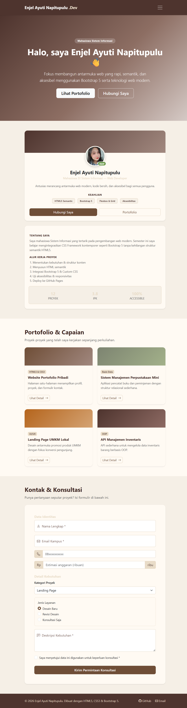

# Portofolio Web - Enjel Ayuti Napitupulu

Tugas Praktikum Mata Kuliah Pemrograman dan Pengujian Aplikasi Web (12S3101)
Institut Teknologi Del - Semester Ganjil 2026/2027

**Nama:** Enjel Ayuti Napitupulu
**NIM:** 12S24056
**Kelas:** 13 SI 2

## Deskripsi

Halaman web portofolio profil profesional satu halaman (*single page showcase*),
awalnya dibangun dengan HTML5 semantik dan CSS murni pada Minggu 2, kemudian
dimodernisasi (*refactored*) pada Minggu 3 menggunakan CSS Framework Bootstrap 5.3
yang dipadukan dengan Custom CSS Overrides bertema personal (coklat-cream).

## Ringkasan Pembaruan Minggu 3

- Integrasi Bootstrap 5.3 CDN (CSS & JS Bundle) beserta Bootstrap Icons
- Responsive Navbar dengan hamburger toggle untuk layar mobile
- Hero Section dengan Call-to-Action
- Grid Portofolio 12-kolom responsif (`row-cols-1 row-cols-md-2 row-cols-lg-3`)
  dengan Modal Dialog untuk detail tiap proyek
- Formulir dimodernisasi dengan Floating Labels, Input Group berikon, dan
  validasi visual Bootstrap
- CSS Custom Properties (`:root`) untuk tema warna personal, dimuat lewat
  `custom-style.css` setelah Bootstrap agar bisa menimpa gaya default

## Tabel Komparasi: Sebelum vs Sesudah Integrasi Framework

| Aspek | Sebelum (Minggu 2 - CSS Murni) | Sesudah (Minggu 3 - Bootstrap 5) |
|---|---|---|
| **Sistem Layout** | Flexbox & Grid ditulis manual per komponen | Sistem Grid 12-kolom Bootstrap (`row`, `col-*`), lebih konsisten di semua breakpoint |
| **Navigasi** | `<nav>` sederhana, menu selalu tampil penuh, tidak ada versi mobile khusus | Navbar `sticky-top` dengan tombol hamburger (`navbar-toggler`) yang collapse otomatis di layar kecil |
| **Kartu Proyek** | Kartu statis, detail proyek hanya ditampilkan lewat teks singkat di kartu | Kartu terhubung ke **Modal Dialog** Bootstrap, menampilkan detail proyek lebih lengkap tanpa pindah halaman |
| **Formulir** | Label & input standar HTML dengan styling CSS manual | **Floating Labels** (`.form-floating`), **Input Group** berikon, serta validasi visual otomatis (`.invalid-feedback`) |
| **Estetika/Ikon** | Tidak ada ikon, hanya teks dan warna | Bootstrap Icons terintegrasi di label form dan tombol |
| **Konsistensi Responsif** | Diuji manual lewat 1 media query (`max-width: 768px`) | Mengikuti breakpoint standar industri Bootstrap (sm, md, lg, xl) yang teruji luas |
| **Jumlah baris CSS kustom** | ± 500 baris CSS murni | ± 300 baris CSS override (karena banyak utilitas diambil alih Bootstrap) |
| **Waktu pengembangan** | Lebih lama, semua komponen (tombol, badge, grid) dibuat dari nol | Lebih cepat, komponen dasar sudah tersedia dari framework, tinggal disesuaikan temanya |

## Teknologi yang Digunakan

- HTML5 (elemen semantik: `header`, `nav`, `main`, `section`, `article`, `aside`, `footer`)
- Bootstrap 5.3.3 (CSS & JS Bundle via CDN)
- Bootstrap Icons 1.11.3
- CSS3 kustom (`custom-style.css`) dengan CSS Custom Properties
- Git & GitHub Pages untuk version control dan deployment

## Struktur Folder

```
├── index.html
├── custom-style.css
├── style.css          (versi Minggu 2, disimpan sebagai arsip)
└── README.md
```

## Cara Menjalankan Secara Lokal

1. Clone repository ini
2. Checkout ke branch `week3-bootstrap`:
   ```bash
   git checkout week3-bootstrap
   ```
3. Buka file `index.html` dengan Live Server (butuh koneksi internet aktif
   karena Bootstrap dimuat lewat CDN)

## Cara Deploy ke GitHub Pages

```bash
git checkout -b week3-bootstrap
git add .
git commit -m "feat(week3): refactor portfolio to bootstrap 5 grid and modern components"
git push -u origin week3-bootstrap
```

Lalu aktifkan di GitHub: **Settings → Pages → Branch: week3-bootstrap → Save**

## Live Demo

https://enjelnapitupulu.github.io/ppw-2026-week2-12S24056/

## Screenshot



## Penulis

Enjel Ayuti Napitupulu - 12S24056 - Sistem Informasi, Institut Teknologi Del.